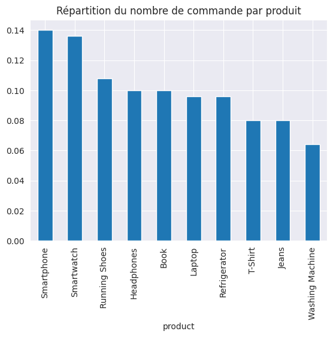
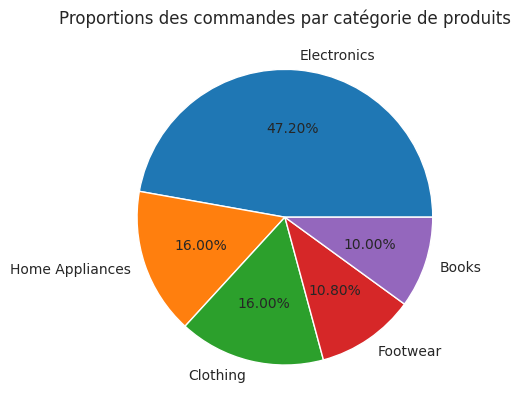
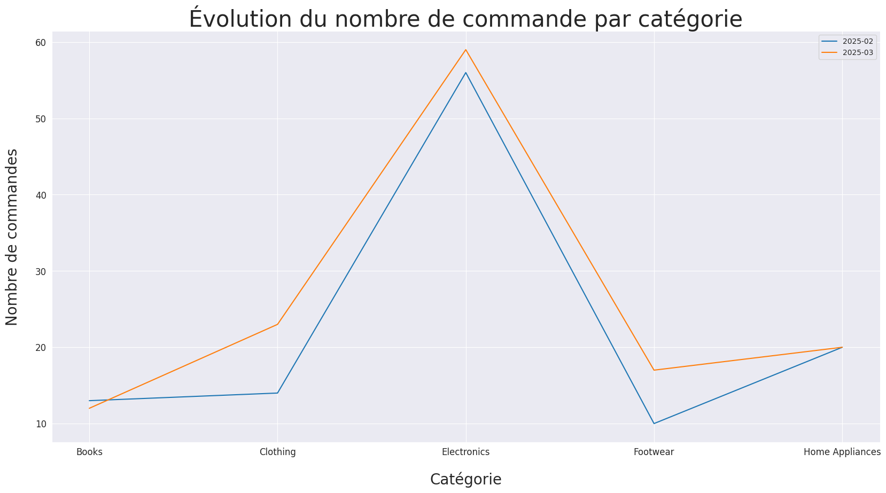
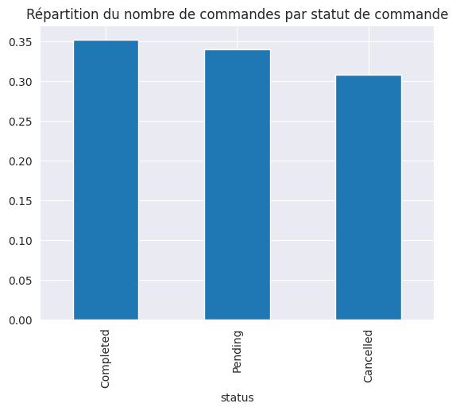
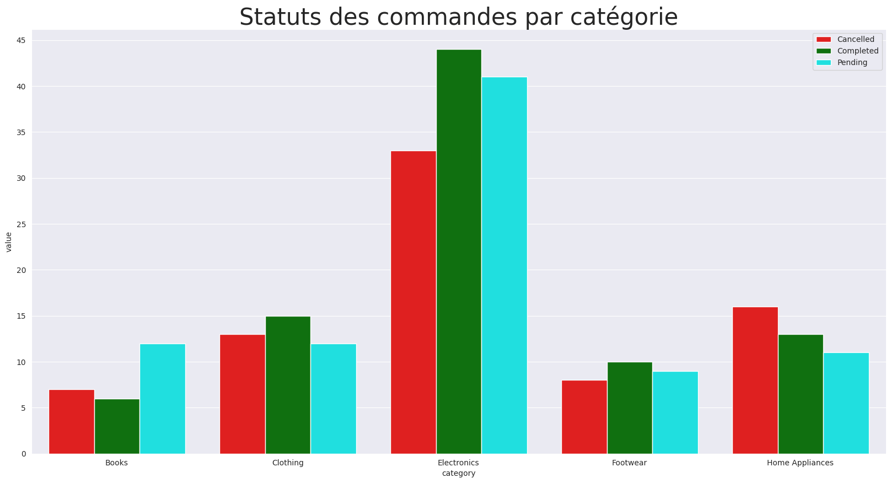
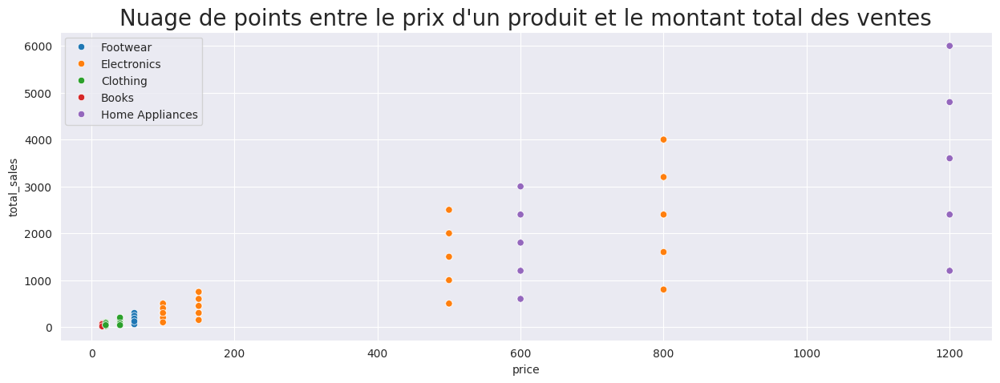
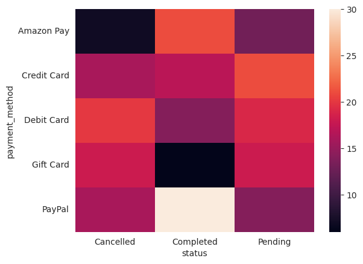

# 📦 Amazon Sales Analysis

## 📝 Description

Ce projet vise à analyser les ventes Amazon à partir d’un dataset afin d’extraire 
des insights clés sur les performances des produits, les tendances de vente, et les comportements d'achat.

## 🎯 Contexte et objectifs business
Ce projet s’inscrit dans le cadre d’une stratégie d’Amazon visant à booster et optimiser les ventes au cours
de l’année 2025. Avec les données de ventes fournies (commandes passées, produits, catégories, prix,
quantités, localisation des clients, statut des commandes, etc.), la mission a été d’identifier des leviers
d’action concrets pour la direction. Les principaux enjeux business sont : 
- Optimiser l’offre produit : Repérer les catégories et produits les plus performants (et ceux qui le sont moins) pour ajuster le catalogue.
- Améliorer le ciblage et les promotions : Identifier les segments de clients ou régions géographiques où
des actions marketing ciblées peuvent augmenter les ventes.
- Anticiper les ruptures de stock et la logistique : Détecter les tendances de demande pour mieux
planifier les stocks et éviter les ruptures ou les surstocks.
- Réduire les pertes de ventes : Comprendre les causes d’annulations de commandes ou d’abandons de
panier (par exemple par moyen de paiement) pour proposer des solutions.
- Maximiser le chiffre d’affaires : À travers toutes ces analyses, fournir des recommandations pour
augmenter le chiffre d’affaires global et la rentabilité.

## 📂 Données

- **Source** : [Lien vers le dataset](https://www.kaggle.com/datasets/zahidmughal2343/amazon-sales-2025)
- **Format** : CSV
- **Taille** : 250 lignes / 11 colonnes
- **Colonnes clés** : `Product`, `Category`, `Total Sales`, `Date`, `Price`, `Quantity`, `Customer Location`, `Payment Method`, `Status`.

## 🛠️ Technologies

- Python
- Pandas, NumPy, Scipy
- Matplotlib, Seaborn
- Jupyter Notebook

## 🔄 Processus d'analyse

1. Chargement et exploration du dataset
2. Nettoyage des données
3. Analyse descriptive
4. Visualisation des données
5. Interprétation des résultats
6. Réalisation des tests statistiques
7. Recommandations

## 📊 Graphiques clés

Voici quelques visualisations générées lors de l'analyse :

| Graphique                                                                                       | Description                                                      |
|-------------------------------------------------------------------------------------------------|------------------------------------------------------------------|
|                                                  | Top 10 des produits les plus vendus                              |
|                                             | Top 5 des catégories de produits les plus vendus                 |
|                                           | Évolution des ventes par mois                                    |
|                                     | Répartition du nombre de commandes par statut                    |
|                                     | Statut des commandes par catégorie                               |
|  | Nuage de points entre le prix et le total des ventes             |
|                    | Heatmap entre les moyens de paiement et le statut de la commande |

## 🧠 Résultats et interprétations

- Les produits "Smartphone", "Smartwatch" et "Running Shoes" ont généré le plus de ventes tandis que "Washing Machine", "Jeans" et "T-shirt" génèrent très peu de ventes.
- La catégorie de produit Electronics à 50% de part de marché à elle toute seule.
- Il y a plus de commandes venant des villes de Houston, Miami et Dallas que des autres villes. Los Angeles, et San Francisco ont le plus faible nombre de commandes.
- Seul un client sur trois complète sa commande.
- La moitié des clients font des achats de moins de 400 dollars et le prix de la plupart des produits achetés ne dépasse pas les 150 dollars.
- Les clients achètent des articles en maximum trois quantités par commmande.
- Les jeans et Running shoes ont connu un plus grand succès auprès des clients avec une augmentation respective des commandes de 200% et 170%.
- Dues au prix, les catégories Books, Clothing, Footwear et Electronics attireront plus de clients que la catégorie Home Appliances dont les prix dépassent largement le budget de la plupart de nos clients.
- La catégorie Electronics peut très vite avoir des ruptures de stocks. Et les catégories Books et Footwear peuvent au contraire connaître un surplus de stocks.
- Les villes de Seattle et Denver génèrent le plus de revenues.
- Il n’y a pas de préférence marquée pour une catégorie de produits dans une ville par rapport à une autre.
- Il y a une forte corrélation linéaire entre le prix et les revenus totaux.
- Le taux d'annulation des commandes est très élevé pour les commandes payées par carte cadeaux.

## 💡 Recommandations

#### 📦 Produits  

✅ Renforcer les stocks des produits les plus populaires : Smartphones, Smartwatches et Running Shoes, notamment dans la catégorie Electronics, qui représente à elle seule 50 % du marché.

❌ Les produits comme Washing Machine, Jeans et T-shirt, peu vendus, pourraient faire l’objet : de promotions ciblées pour écouler les stocks, ou d’un déréférencement progressif selon leur coût de stockage.

📈 Les Running Shoes et Jeans ont connu une hausse des ventes de 170 % et 200 % respectivement : ces produits méritent une mise en avant marketing.

#### 🏙️ Zones géographiques

📍 Houston, Miami et Dallas enregistrent le plus grand nombre de commandes : il est pertinent de renforcer la logistique et d’y intensifier le ciblage publicitaire.

💰 Seattle et Denver génèrent un revenu moyen plus élevé malgré un volume de commandes plus faible : ces villes sont idéales pour des campagnes premium.

#### 🛒 Comportement client

⚠️ Seulement 1 client sur 3 finalise sa commande. Il est urgent de : améliorer l’expérience utilisateur sur le site, proposer des rappels automatiques ou des offres de dernière minute pour réduire l’abandon de panier.

💳 Le taux d’annulation est très élevé pour les commandes payées par cartes cadeaux : il est recommandé de : mettre en place des vérifications supplémentaires, ou restreindre l’usage de ce moyen de paiement pour certaines commandes.

#### 💰 Prix & budget

🧾 50 % des clients achètent pour moins de 400 \$, et la plupart des produits achetés coûtent moins de 150 \$ : il est préférable de se concentrer sur les produits abordables, et de repenser la stratégie autour des Home Appliances, dont les prix dépassent le budget moyen.

#### 📊 Stocks

⚠️ La catégorie Electronics est exposée aux ruptures de stock → prévoir un suivi automatique de l’inventaire.

📚 Les catégories Books et Footwear risquent de connaître un surplus → adapter les commandes et éviter le surstock.

## 👨‍💻 À propos

Projet réalisé par **Harold Chanwin**, étudiant en Data et IA, passionné par le monde de la Data.

- [GitHub](https://github.com/chanwinharold)
- [LinkedIn](https://www.linkedin.com/in/harold-chanwin-profile)

## ✅ Statut du projet

✔️ Analyse terminée  
🚧 Améliorations futures possibles : ajout de modèles prédictifs, dashboard interactif

## 📄 Licence

Ce projet est sous licence [MIT](https://opensource.org/licenses/MIT).  
Tu es libre de le réutiliser, le modifier ou le distribuer, à condition de mentionner l’auteur original.
